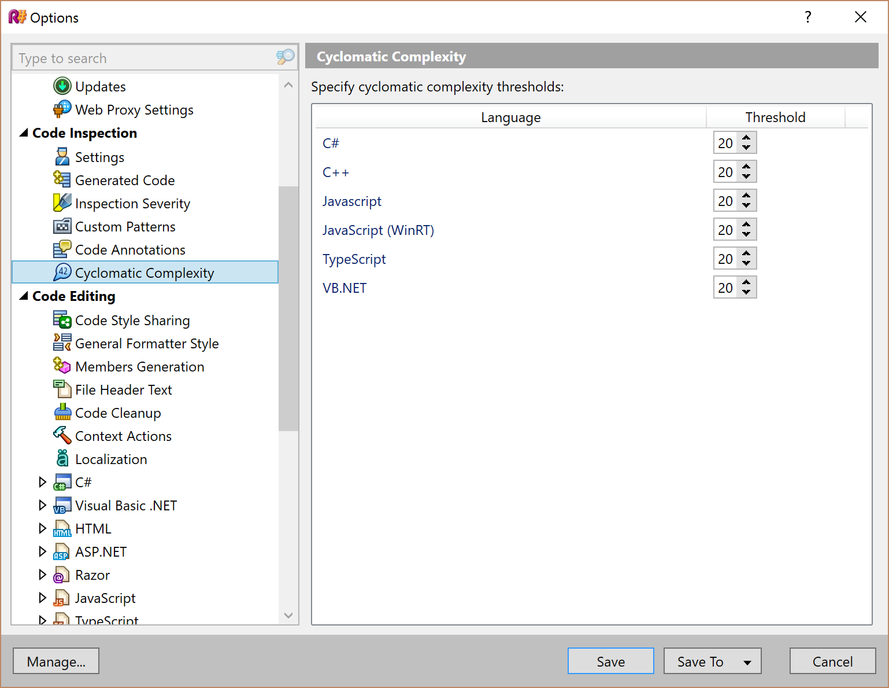

# Cyclomatic complexity plugin for ReSharper

This is a ReSharper plugin that measures [cyclomatic complexity](https://en.wikipedia.org/wiki/Cyclomatic_complexity) as you type. If the complexity of a method, function or property exceeds a configurable threshold, the method, function or property is marked with a warning highlight ("squiggly"). It supports ReSharper 9.1, and calculates cyclomatic complexity for C#, VB, JavaScript, TypeScript and C++. 

It can be installed by going to **ReSharper &rarr; Extensions Manager** and searching for "Cyclomatic Complexity".

Cyclomatic complexity is a metric intended to show the complexity of your code. It measures the number of paths through a code block - the more branches and conditional statements, the higher the metric. As the code gets more complex, the metric gets higher. A higher value is a good indicator that a method is getting too complex, and is becoming a maintainability risk, and should be refactored. You can read more about [cyclomatic complexity at wikipedia](https://en.wikipedia.org/wiki/Cyclomatic_complexity).

The complexity of a method, function or other code member is always available as a tooltip on the method name:

When the complexity reaches a configurable threshold, the tooltip is shown as a warning:

And the complexity threshold can be configured in the options, per language:

